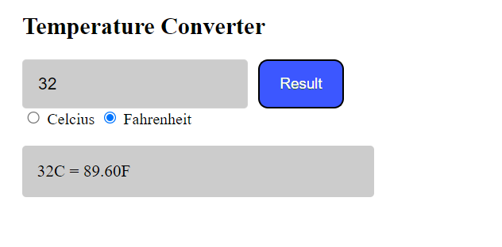

# Hello everyone! 

Today I will be showing how to create a super simple temperature converter using only HTML, CSS, and a little bit of JavaScript. If by chance you get lost, feel free to look at the demo I have included within the README file.

## Step 1: HTML Template
We must start by implementing our !D0CTYPE into our HTML file. If you are on VSCode you can type and enter "!" into your .HTML file and an automated template will appear like so:

```HTML
<!DOCTYPE html>
<html lang="en">
<head>
    <meta charset="UTF-8">
    <meta http-equiv="X-UA-Compatible" content="IE=edge">
    <meta name="viewport" content="width=device-width, initial-scale=1.0">
    <title>Temperature Converter</title>
</head>
<body>
    
</body>
</html>
```

Once you have your basic template the second thing we need to is link our CSS, and JavaScript file to your HTML. Of course you should have an assets folder, outside of your HTML file to contain your CSS file and JavaScript file. Now , under '<title>Temperature Converter</title>' paste these commands:

```HTML
    <link rel="stylesheet" href="assets/style/style.css" media="screen"> 
    <script src="assets/script/index.js" defer></script>
```

Our code should look something like this: 

```HTML
<!DOCTYPE html>
<html lang="en">
<head>
    <meta charset="UTF-8">
    <meta http-equiv="X-UA-Compatible" content="IE=edge">
    <meta name="viewport" content="width=device-width, initial-scale=1.0">
    <title>Temperature Converter</title>
    <link rel="stylesheet" href="assets/style/style.css" media="screen"> 
    <script src="assets/script/index.js" defer></script>
</head>
<body>
    
</body>
</html>
```


## Step 2: HTML Formatting

Now we got all the essentials out of the way, lets start creating our converter. In my example I do have a basic header implemented, but we will just be focusing on the temperature converter. Lets first start with creating our section with the following classes shown below, and a form with two input types. First one being type="text" and second one being type="button". Classes and names can be changed to your liking.

```HTML
<section class="temperature container">
    <h1 class="title">Temperature Converter</h1>
        <form>
            <input type="text" class="enternumber" value="Enter your number">
            <input type="button" class= "result" value="Result">
        </form>
</section>
```

Next we will create another another section (or a div) to contain our two radio buttons. These radio buttons will allow the user to switch between celcius and fahrenheit. and also another section for our output. Again naming convention is optional.

```HTML 
 <section class="radio-btn">

    <input type="radio"
    class= "tempC"
    name="radio"
    >
    <label for="tempC">Celcius</label>

    <input type="radio"
    class = "tempF"
    name="radio"
    >
    <label for="tempF">Fahrenheit</label>

</section>  

<section class="output">
    <p></p>
</section>
```
Our output should look like this. If it doesn't, re-check your code and make sure you have everyhing required.


#### End result:
```HTML   
    <body>
        <section class="temperature container">

            <h1>Temperature Converter</h1>

                <form>
                    <input type="text" name="one" class= "enternumber" placeholder="Enter your number">
                    <input type="button" class= "result" value="Result">
                </form>

                <section class="radio-btn">

                    <input type="radio"
                    id= "tempC"
                    name="radio"
                    >
                    <label for="tempC">Celcius</label>

                    <input type="radio"
                    id = "tempF"
                    name="radio"
                    >
                    <label for="tempF">Fahrenheit</label>

                </section>  

                <section class="output">
                    <p>3232</p>
                </section>
        </section>
    </body>
```

## Step 3: CSS Styling

Next step is styling our code. To keep everything organized and easier, I always style my HTML code from top to bottom. Just like HTML, lets start with our essentials. First lets create a root variable for all the colours we are going to use: 

```CSS 
:root {
    --app-blue: #3c57ff;
    --app-blue-hover: #364ee6;
   }
```
The two variables will be our button style. And of course, feel free to implement your own colours as you wish. 

### Styling Template: 
This is just an example you can use, but feel free to take the time and style the page to your liking!

```CSS
.container {
    width: min(100% - 30px, 1080px);
    margin-inline: auto;
}

.flexbox {
    display: flex;
}

main {
    background-color: #fff;
    width: 100%;
}

form {
    display: flex;
    margin-top: 20px;
    width: 30%;
    text-align: right;
}

input[type="text"] {
    width: 100%;
    height: 48px;
    padding: 0 15px;
    border: 1px solid rgba(255, 255, 255, 0.1);
    background-color: rgb(0 0 0 / 0.2);
    border-radius: 4px;
    font-size: 17px;
    font-weight: 400;
    text-align: left;
}

.output {
    height: 52px;
    width: 30%;
    padding: 0 15px;
    border-radius: 4px;
    background-color: rgb(0 0 0 / 0.2);
    text-align: left;
}

.result{
    background-color:var(--app-blue);
	border-radius: 10px;
	cursor:pointer;
	color:#ffffff;
	font-size:15px;
    padding: 10px 20px;
    margin-left: 10px;
	text-decoration:none;
	text-shadow:0px 1px 0px #2f6627;
}

.output p {
    font-size: 17px;
    font-weight: 400;
    line-height: 52px;
    cursor: default;
}

```

## Step 4: JavaScript

Now the real fun begins, the JavaScript! The code is really simple and only requires a couple of if else statements! If you aren't familiar with JavaScript, the "onEvent" is a shorthand for addEventListener.

## Explaining the script

First we declare variables by using a similiar naming convention to our classes, and identifying that class. To make life easier, I declared the users input by adding ```.value``` and to make sure that our users input is in fact a number, I used ```!isNaN(userInput)```, you can also use ```isNumber(userInput)```. The easiest part of the script is grabbing whether the user clicked celcius or fahrenheit. We do that by adding .checked to the end of our variable. So if fahrenheit is checked > convert celcius to fahrenheit and if celcius is checked > convert fahrenheit to celcius. 

```JavaScript
function onEvent(event, selector, callback) {
    return selector.addEventListener(event, callback);
}

const enterNumber = select('.enternumber');
const result = select('.result');
const celcius = document.getElementById('tempC');
const fahrenheit = document.getElementById('tempF')
const output = select('.output p');

onEvent('click', result, () => {

    let userInput = enterNumber.value;
    if(!isNaN(userInput)){

    } if (fahrenheit.checked) {
        let toF = userInput * 1.8 + 32; 
        output.innerText = `${userInput}C = ${toF.toFixed(2)}F`

    } if (celcius.checked) {
        let toC = (userInput - 32) * 5 / 9;
        output.innerText = `${userInput}F = ${toC.toFixed(2)}C`

    } if (isNaN(userInput)) {
        output.innerText = `Please enter a valid number`

    } if (display.innerText = '');
    output.innerText = `Please enter a number`

});
```
#### Your code should look like this and be up and running, thank you for reading!


